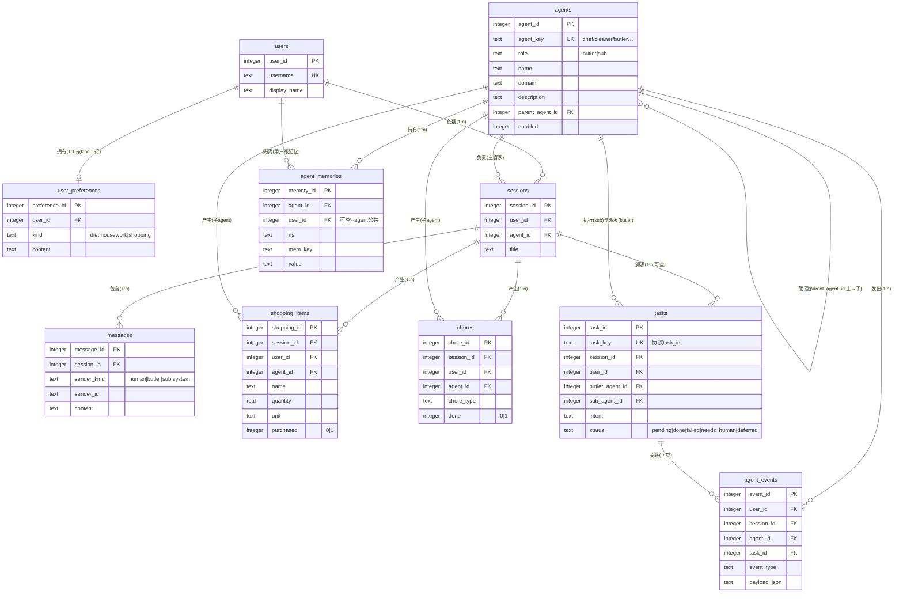

# 数据库设计（@meimaohouse/db）

> 版本 0.1 · SQLite（better-sqlite3）· schema 版本化迁移（`user_version`）
> 目标：**3NF 范式 · 多用户隔离 · 主/子 agent 统一建模 · 任意新子 agent 零 schema 变更接入**

---

## 1. 设计决策

| 决策点 | 结论 | 理由 |
|---|---|---|
| 数据库 | SQLite 单文件（`./data/butler.db`，`BUTLER_DB_PATH` 可覆盖） | 单机管家场景，零部署；WAL + 外键强制开启 |
| 访问层 | better-sqlite3 原生 SQL + 通用仓储类 | 同步事务可控，类型化出口 |
| 通用化机制 | 通用核心域模型：固定核心表 + 通用事件流水 | 领域事实要么落通用域（购物/家务/记忆/任务），要么写 `agent_events`，新子 agent 不建新表 |
| 身份模型 | 主/子 agent 同表 `agents`，`role` 区分，`parent_agent_id` 自引用表达"主管理子" | 新子 agent = `agents` 表 INSERT 一行 |
| 多用户 | 全部业务表挂 `user_id` 外键，用户删除级联清数据 | 管家服务多个家庭成员 |

## 2. 与 ER 图的对照（png → 落地 schema）

你的 ER 图共 5 个实体。落地时**保留全部语义**，并补上管家框架必需的 5 张表：

| ER 图实体/关系 | 落地表 | 变化说明 |
|---|---|---|
| 用户（用户ID、用户名） | `users` | 保留；补 `display_name` |
| 用户偏好（1:1 用户；饮食/家务/购物 3 列） | `user_preferences` | **纵向化**：固定 3 列 → `(user_id, kind, content)` 唯一键。3NF 上固定列没问题，但纵向化后新增偏好类别（如"园艺偏好"）不用改表，与"通用数据库"目标一致 |
| agent 会话（1:n 用户） | `sessions` | 保留；补 `agent_id`（负责 agent，缺省主管家） |
| 购物记录（1:n 会话） | `shopping_items` | 保留语义（名称/数量/是否已购）；`数量`与`名称`分离成原子列（1NF），补 `agent_id`（哪个子 agent 产生）、`note` |
| 家务记录（1:n 会话） | `chores` | 保留语义（类型/是否完成）；补 `due_at`、`note`、`agent_id` |
| ——（ER 图缺失） | `agents` | ER 图没有 agent 实体，但需求要"存主/子 agent 数据"：`role ∈ {butler, sub}` + `parent_agent_id` 层级 |
| ——（ER 图缺失） | `messages` | 会话逐条消息（`sender_kind ∈ {human, butler, sub, system}`），支撑对话持久化 |
| ——（ER 图缺失） | `tasks` | 通信协议（TaskEnvelope/ResultEnvelope）的落库：`intent/params/priority/status/summary/detail/error/suggestions` |
| ——（ER 图缺失） | `agent_memories` | `Memory` 接口的 SQLite 实现：`(agent_id, user_id, ns, key)` 唯一，多用户隔离 |
| ——（ER 图缺失） | `agent_events` | 通用事件流水：任意子 agent 自定义 `event_type` + JSON payload，不污染业务表 |

## 3. 表结构一览

### 3.1 实体关系图（Mermaid）



### 3.2 表清单

```sql
users(user_id PK, username UNIQUE, display_name, created_at)
user_preferences(preference_id PK, user_id→users CASCADE, kind∈{diet,housework,shopping}, content,
                 UNIQUE(user_id, kind), updated_at)
agents(agent_id PK, agent_key UNIQUE, role∈{butler,sub}, name, domain, description,
       system_prompt, parent_agent_id→agents SET NULL, config_json, enabled, created_at)
sessions(session_id PK, user_id→users CASCADE, agent_id→agents SET NULL,
         title, created_at, updated_at)                     -- 索引 (user_id, updated_at DESC)
messages(message_id PK, session_id→sessions CASCADE, sender_kind∈{human,butler,sub,system},
         sender_id, content, meta_json, created_at)         -- 索引 (session_id, message_id)
tasks(task_id PK, task_key UNIQUE, session_id→sessions SET NULL, user_id→users SET NULL,
      butler_agent_id→agents SET NULL, sub_agent_id→agents RESTRICT,
      intent, params_json, priority∈{low,normal,high}, source, deadline,
      status∈{pending,done,failed,needs_human,deferred}, summary, detail_json, error,
      suggestions_json, created_at, completed_at)
agent_memories(memory_id PK, agent_id→agents CASCADE, user_id→users CASCADE,
               ns DEFAULT 'default', mem_key, value, created_at, updated_at,
               UNIQUE(agent_id, IFNULL(user_id,0), ns, mem_key))
shopping_items(shopping_id PK, session_id→sessions CASCADE, user_id→users CASCADE,
               agent_id→agents RESTRICT, name, quantity>0, unit, purchased∈{0,1},
               note, created_at, updated_at)
chores(chore_id PK, session_id→sessions CASCADE, user_id→users CASCADE,
       agent_id→agents RESTRICT, chore_type, done∈{0,1}, note, due_at, created_at, updated_at)
agent_events(event_id PK, user_id→users SET NULL, session_id→sessions SET NULL,
             agent_id→agents SET NULL, task_id→tasks SET NULL, event_type, payload_json, created_at)
```

删除语义约定：

- **删用户** → 级联清空其偏好/会话/消息/购物/家务/记忆（用户数据完全归属用户）；
- **删会话** → 级联清空消息与该会话产生的购物/家务记录（会话是产生语境）；任务行 `session_id` 置 NULL 保留审计；
- **删 agent** → 有任务引用时被 `RESTRICT` 拒绝（保护协议历史）；层级关系 `SET NULL`。

## 4. 3NF 论证

逐表检查"每个非主属性完全、直接依赖于码，且不传递依赖于码"：

1. **无部分依赖**：所有表都是单列代理主键或显式组合唯一键（`user_preferences(user_id, kind)`、`agent_memories(agent_id, user_id, ns, mem_key)`），非主属性依赖整个键。
2. **无传递依赖**：例如 `messages` 不冗余 `user_id`（可经 `session_id` 推导，存了就是传递依赖）；`sessions` 不存 agent 的 name/domain（只存 `agent_id` 外键）；`tasks` 不存子 agent 的 domain（只存 `sub_agent_id`）。
3. **原子性（1NF）**：数量/名称/单位/状态全部独立成列，不用逗号拼接；协议的结构化扩展（`params/detail/payload`）是"任务/事件自身的一个文档属性"，以 JSON 单列存放，不与其他实体的属性交叉，不引入表内传递依赖。
4. **消除多值依赖（4NF 方向）**：用户偏好纵向化，偏好类别扩展不改表。

## 5. 通用数据库接口（子 agent 怎么用）

**核心原则：任何子 agent 用同一套仓储类，只换 `agent_id` 身份。**

```ts
import {
  openDatabase, ensureButlerAgent, ensureSubAgent, AgentContext,
  ShoppingRepository, ChoreRepository, MemoryRepository, EventRepository, TaskRepository,
  createSqliteMemory,
} from '@meimaohouse/db'

const db = openDatabase()                                  // 建库+迁移，幂等
const butler = ensureButlerAgent(db)                       // 主管家身份入库
const myAgent = ensureSubAgent(db, {
  id: 'mynewagent', name: '新工种', domain: '某领域', description: '……',
}, { parentAgentId: butler.agent_id })                     // ★ 新子 agent 接入 = 这一步

const ctx = AgentContext.get(db, 'mynewagent')!
const userId = ctx.resolveUser('alice', '主人')             // 解析/创建用户
const sessionId = ctx.resolveSession(userId)               // 解析/创建会话

// —— 领域数据：三选一，按数据性质 ——
new ShoppingRepository(db).add({ session_id: sessionId, user_id: userId,
  agent_id: myAgent.agent_id, name: '洗衣液', quantity: 1, unit: '瓶' })   // 结构化购物
new ChoreRepository(db).add({ session_id: sessionId, user_id: userId,
  agent_id: myAgent.agent_id, chore_type: '换床单' })                       // 结构化家务
new EventRepository(db).log({ agent_id: myAgent.agent_id, user_id: userId,
  event_type: 'sensor.reading', payload: { room: '厨房', temp: 24.5 } })    // ★ 任意领域事实走事件流水

// —— 长期记忆（可直接注入 defineSubAgent 的 memory 参数）——
const memory = createSqliteMemory(db, { agentId: myAgent.agent_id, userId })
await memory.set('preferences', '每周三浇花')
defineSubAgent({ id: 'mynewagent', /*…*/ memory })
```

接口分层：

```
AgentContext            身份解析（agent/用户/会话，幂等 upsert）
UserRepository          用户 CRUD + ensure
PreferenceRepository    偏好 upsert/list（diet/housework/shopping）
AgentRepository         agent 花名册/层级/启停
SessionRepository       会话 CRUD + 活跃度 touch
MessageRepository       消息追加（自动 touch 会话）
TaskRepository          任务登记/结果写回/多维查询
MemoryRepository        键值 + 追加式记忆（用户级/agent 级隔离）
ShoppingRepository      购物（批量标记已购）
ChoreRepository         家务（待办/完成）
EventRepository         事件流水（通用扩展通道）
createSqliteMemory      实现 agent-sdk 的 Memory 接口（可直接传给 defineSubAgent）
```

## 6. 框架集成点

| 位置 | 集成方式 |
|---|---|
| `packages/butler-core`（Butler） | `new Butler({ db })` 可选注入：`chat()` 持久化 human/butler 消息 + 事件；`delegate()` 登记任务 → 执行 → 结果写回；未传 db 行为不变 |
| `apps/butler-web`（server.ts） | 启动即建库并登记管家/子 agent 身份；聊天数据持久化到 `./data/butler.db` |
| `packages/agents/chef` | `createChef({ memory })` 工厂可注入 SQLite 记忆；默认导出保持原样 |
| `examples/db-demo.ts` | 不接模型的全量演示：`npm run demo:db` |

## 7. 迁移与演进

- DDL 按版本内联在 `packages/db/src/db.ts` 的 `MIGRATIONS` 数组，`user_version` 单调推进，重复启动自动跳过已执行版本；
- **新增表/列 = 追加一段 migration**，禁止修改已发布的历史 migration；
- `src/schema.sql` 是 v1 的等价参考副本（供评审/外部工具使用），运行时以 `MIGRATIONS` 为准。

## 8. 查看数据库内容 / 结构

三种方式（按顺手程度排序）：

1. **Web 浏览器（推荐）**：`npm run web` 后打开 **http://127.0.0.1:8790/db.html**
   - 左侧表清单（含行数），点击查看：列结构、建表 DDL、索引、分页数据；
   - 只读实现：`GET /api/db/tables` 与 `GET /api/db/table/<名>?limit=&offset=`（表名白名单校验，见 `packages/db/src/admin.ts`）；
2. **CLI**：
   ```bash
   npm run db:inspect              # 全库总览：表 + 行数 + 列结构 + 索引
   npm run db:inspect -- tasks     # 单表：DDL + 列结构 + 最近 20 行
   npm run db:inspect -- messages 50
   ```
3. **外部 GUI**：用 DBeaver / DB Browser for SQLite / VS Code 的 SQLite 插件直接打开 `data/butler.db`（WAL 模式，服务运行中也可安全只读查看）。

## 9. 工作记忆机制（butler-core/memory.ts，Hermes 纪律：上下文恒定有界）

管家每轮对话的工作记忆**从数据库动态组装**，进程内不攒历史（重启零失忆）：

```
本轮模型输入 = 管家 system prompt（人设+花名册）
             + 【长期纪要】agent_memories(ns='brief', key='brief')，覆盖式更新，≤600 字
             + 【近期对话】最近 20 条消息（messages 表现读）
             + 【主人本轮消息】
```

**水位与压缩**：`agent_memories(ns='brief', key='watermark')` 记录已压缩到的 message_id；未压缩消息 ≥ 30 条时，用管家模型把 `[水位, 最新]` 段压缩成新纪要（一次性调用），覆盖写回并推进水位。压缩参数：`WINDOW=20 / COMPRESS_THRESHOLD=30 / BRIEF_MAX_CHARS=600`（butler-core 可导入调整）。

**清除规则（纪要不膨胀的关键）**——纪要是覆盖式重写的"活文档"，每次压缩按三条规则产出全新纪要：
1. **解决即弃**：主人已明确办结/取消/拒绝的事项 → 从纪要删除；
2. **过期自灭**：带日期的待办日期已过且无后续讨论 → 删除；
3. **准入收紧**：只收"未决事项 / 稳定偏好 / 重要承诺"三类，寒暄与过程细节不进纪要。

因此上下文恒为 `纪要(≤600字) + 20 条`，物理上不随使用时间膨胀；`messages` 全量保留仅作审计（不在上下文里）。查看纪要：`db.html` → `agent_memories` 表，或 `butler.getBrief()`。

## 10. 测试

`npm test -w @meimaohouse/db`：14 个用例覆盖 迁移幂等 / 唯一约束 / 外键拒绝 / 级联删除 / RESTRICT 保护 / 多用户记忆隔离 / 任务生命周期 / 各仓储过滤语义。
