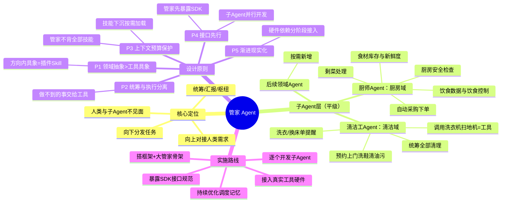

# 管家 Agent 架构 — 思维导图 & 设计精华

> 来源：Susanti 关于"大庄园式管家"多轮讨论的提炼
> 一句话概括：**一个管家（总协调 Agent）+ 一群领域子 Agent（平级、彼此不见面）+ 人类只见管家**

---

## 一、思维导图（缩进版）

```
管家 Agent 架构
│
├─ ① 核心定位：大庄园式管家
│   ├─ 向上：对接人类的需求与思想（唯一入口）
│   ├─ 向下：对子 Agent 分发命令与任务（唯一出口）
│   ├─ 隔离原则：人类与子 Agent 永远不见面
│   │   └─ 在人类眼里只有管家，一切由管家转述/汇报
│   └─ 本质：总协调者 + 信息枢纽 + 汇报层
│
├─ ② 子 Agent 层（平级、互相独立）
│   ├─ 厨师 Agent ── 管"厨房域"
│   │   ├─ 食材管理：冰箱库存、新鲜度监控（依赖摄像头等硬件）
│   │   ├─ 采购：需要什么菜 → 直接上网下单配送到家
│   │   ├─ 安全：厨房安全检查、用火用电
│   │   ├─ 剩菜/废弃物处理
│   │   └─ 饮食数据：统计吃饭数据、帮助控制饮食
│   ├─ 清洁工 Agent ── 管"清洁域"
│   │   ├─ 统筹所有清理（不是单个扫地机器人！）
│   │   ├─ 洗衣服、提醒换床单
│   │   ├─ 预约上门洗鞋、定期上门清理油污
│   │   └─ 工具调用：洗衣机、扫地机器人 = 它手里的工具
│   └─ 后续领域 Agent（按需新增）
│
├─ ③ 设计精华（原则层）
│   ├─ P1 领域抽象 > 工具具象
│   │   ├─ 扫地 ≠ 建"扫地 agent"，只是"清洁"领域的一个实例
│   │   └─ 限定一个大方向，方向内所有具象能力 = 插件 / Skill
│   ├─ P2 统筹与执行分离
│   │   ├─ Agent 负责统筹决策，不亲自干体力活
│   │   └─ 物理做不到的事（炒菜）→ 交给工具/服务兜底
│   ├─ P3 上下文预算保护
│   │   ├─ 管家不背全部技能，否则上下文撑爆 → 降智（Hermes 教训）
│   │   ├─ 技能下沉到子 Agent，上下文按需加载、互相隔离
│   │   └─ 管家只保留：调度、记忆、汇报
│   ├─ P4 接口先行
│   │   ├─ 先做大管家，暴露 SDK / 标准接口
│   │   └─ 子 Agent 按接口对接，可独立开发、并行演进
│   └─ P5 渐进现实化
│       ├─ 理想能力（冰箱摄像头、自动买菜）依赖硬件/外部服务
│       └─ 先定义接口，能力分阶段接入
│
└─ ④ 实施路线
    ├─ 第 1 步：搭框架 + 大管家骨架（调度/记忆/汇报）
    ├─ 第 2 步：管家暴露 SDK / 接口规范
    ├─ 第 3 步：逐个开发子 Agent（模块化，可并行）
    ├─ 第 4 步：接入真实工具与硬件（渐进增强）
    └─ 第 5 步：随使用积累，优化调度与记忆策略
```

---

## 二、思维导图（Mermaid 版，可在支持 Mermaid 的编辑器/网页渲染）



---

## 三、设计精华提炼（人话版）

1. **管家 = 唯一入口 + 唯一出口**。人类只跟管家对话，管家把需求翻译成任务分发给子 Agent，再把结果汇总汇报。这个"见面隔离"让人类侧体验始终稳定，也让子 Agent 可以随时增删替换而不影响人类。

2. **子 Agent 按"领域"划分，不按"工具"划分**。扫地机器人、洗衣机、买菜 App 都只是工具；"清洁工""厨师"才是领域。一个领域一个 Agent，领域内的所有具体能力全部做成插件/Skill。这样 Agent 的统筹和调用能力才不被弱化——这是整个设计里最核心的一条。

3. **上下文是硬预算**。管家绝不多背技能，否则就是 Hermes 的下场：越用越好用 → 越用越降智。解决方法是：能力下沉、上下文隔离、按需调度，管家只保留调度 + 记忆 + 汇报三件事。

4. **先框架后血肉**。仓库从零开始：第一步做框架 + 大管家骨架，大管家暴露 SDK/接口；子 Agent 各自独立开发、模块化演进。不现实的能力（比如"炒菜"这种物理动作）先留接口，由工具/服务兜底，硬件到位再逐步接上。

---

## 四、一个可以直接用的仓库骨架建议

```
home-agent/
├── packages/
│   ├── butler-core/        # 大管家核心：调度器、记忆、汇报协议
│   ├── agent-sdk/          # 子 Agent 接入 SDK（接口规范）
│   └── agents/
│       ├── chef/           # 厨师 Agent 壳（厨房域）
│       └── cleaner/        # 清洁工 Agent 壳（清洁域）
├── docs/
│   └── protocol.md         # 管家↔子Agent 通信协议
└── examples/
    └── demo.ts             # 最小可运行示例
```
